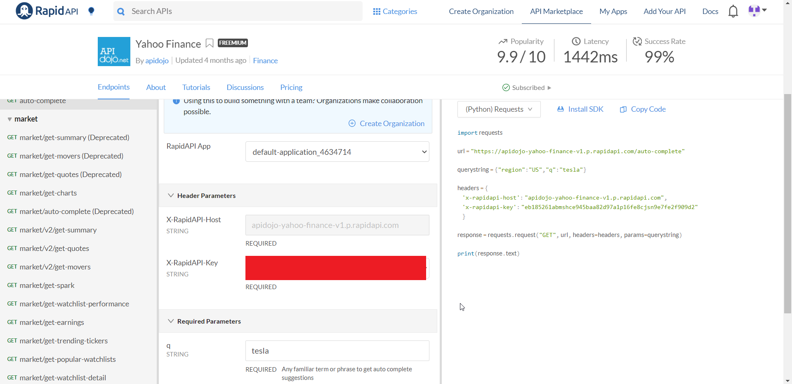

# python-stock-notifier
 [](https://travis-ci.com/galbirk/python-stock-notifier)<br>
## 
Python Script that push windows 10 notifications on selected stock price.
## Table of Contents
- [Configuration](#Configuration)
  * [Config Variables](#Config-Variables)
- [How to Run?](#How-to-Run?)
  * [Create rapid API Acount and Get API key](#Create-rapid-API-Acount-and-Get-API-key)
  * [Fill Configuration file](#Fill-Configuration-file)
  * [Clone git repo](#Clone-git-repo)
  * [Install requirements for the script](#Install-requirements-for-the-script)
  * [Create Windows Service or Run the script background or foreground](#Create-Windows-Service-or-Run-the-script-background-or-foreground)
    - [Create Windows Service](#Create-Windows-Service)
    - [Run the Script in the Background](#Run-the-Script-in-the-Background) 
    - [Run the script in the Foreground](#Run-the-script-in-the-Foreground)
- [License](#License)
- [Author Information](#Author-Information)
## Configuration
The script loads configuration from [config.py](config.py) file.
### Config Variables
* **API_KEY** --> The api key for rapidAPI yahoo finance.
* **LOG_PATH** --> Log file path.
* **STOCK_SYMBOL** --> Stock Symbol.
* **STOCK_REGION** --> Stock Region.
* **ICON_PATH** --> Path to Icon. 
* **CHECK_INTERVAL** --> Interval For Checking stock price in seconds.
```bash
API_KEY = 'myapikey'
LOG_PATH = r"{}\DEBUG.log".format(os.path.dirname(os.path.realpath(__file__)))
STOCK_SYMBOL = "FVRR"
STOCK_REGION = "US"
ICON_PATH = r"{}\images\bull.ico".format(os.path.dirname(os.path.realpath(__file__)))
CHECK_INTERVAL = 60 # Check every x seconds
```
## How to Run?
1. Create rapid API account [here](https://rapidapi.com/) and generate API key.
2. Fill the configuration in [config.py](config.py).
3. Clone git repo.
4. Install requirements for the script.
5. Create Windows Service for the script/Run the script background or foreground.
### Create rapid API Acount and Get API key
1. Go to [https://rapidapi.com/](https://rapidapi.com/).
2. Register and create Account.
3. Go to [yahoo finance API](https://rapidapi.com/apidojo/api/yahoo-finance1).
4. Get your API key in the "X-RapidAPI-Key" field.<br><br>
### Fill Configuration file
Enter the API key and all the other variables to [config.py](config.py).
### Clone git repo
Clone the repository:<br>
```bash
git clone https://github.com/galbirk/python-stock-notifier.git
cd python-stock-notifier
```
### Install requirements for the script
Run the command below:<br>
```bash
pip install -r requirements.txt
```
### Create Windows Service or Run the script background or foreground
#### Create Windows Service
You can Compile the script with py2exe or other module, and run the exe file as windows service.
#### Run the Script in the Background
Run the script with pythonw.exe with the command below:<br>
```bash
pythonw.exe getstock.py
```
To stop the script, stop his process in task manager.
#### Run the script in the Foreground
You can simply run the script as regular python script with the command below:<br>
```bash
python.exe getstock.py
```
## License
BSD

## Author Information
<b>Gal Birkman, DevOps Engineer.</b><br>
<b>email:</b> galbirkman@gmail.com<br>
<b>GitHub:</b> https://github.com/galbirk
